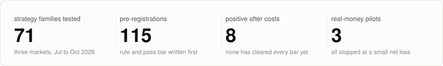
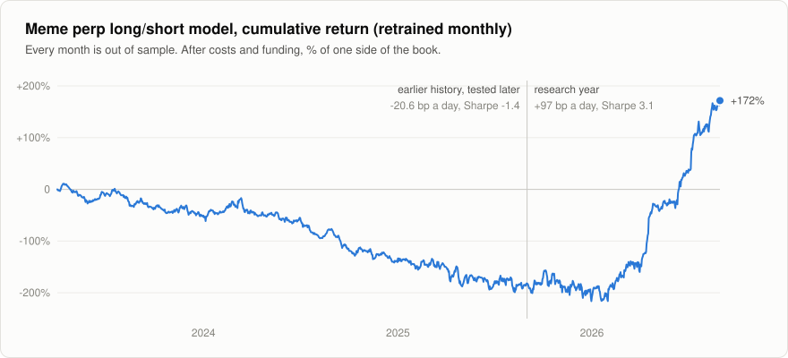

# Trading research log

From July to October 2026 I looked for a trading edge with about $4,000, mostly in places big funds don't bother with: Solana memecoins, small crypto perps and prediction markets. I tested 71 strategy ideas.

Eight of them were still positive after costs once I'd tested them properly (held-out data, separate periods, real order books). I haven't traded any of those yet, and none has cleared every bar I set. The rest failed, and three small real-money tests lost roughly $100 between them.

<picture>
  <source media="(prefers-color-scheme: dark)" srcset="docs/img/scoreboard-dark.svg">
  
</picture>

I'm a final-year Industrial Engineering and Decision Analytics student at HKUST. The ideas and the decisions here are mine. I used Claude Code to write the code and run the backtests ([more on that below](#how-i-used-ai)). None of this is investment advice.

## Why most of them failed

I picked these markets on purpose. A small account can trade them and a large fund can't put real money to work there, so that's where I expected an edge to be left over. The cost of that choice is that a positive median trade is very hard to get in them, and the largest group of my ideas was on the hardest one, pump.fun.

There, a trade is losing before any decision has been made. Buying with no filter returns −25.28% a trade. Fees are 2.5 to 3.5% a round trip, and about 1 coin in 90 graduates. It isn't only a cost problem either. I repriced 4,470 rule combinations with zero fees and mid-price fills, and the best one still had a median of −0.28% and won 47.9% of the time. The typical coin goes down after anyone's buy, and the money is in a few very large winners.

That return shape is what makes it easy to fool yourself. A rule can average well and still lose on most trades: the best rule on my rebuilt wallet list averaged +2.97% a trade with a median of −5.88%. So an average from a backtest told me very little. So the tests here report the median, a t-stat on daily totals (trades on the same day aren't independent) and how much of the profit came from the best three days, and passing on one period only earned an idea a test on another. Most of the 71 stopped at one of those. [Case study 6](case-studies/06-pumpfun.md) has the pump.fun numbers.

## What came out positive

Every number here is after fees, funding and slippage.

| Idea | Result | How it was tested | Where it stands |
|---|---|---|---|
| Long/short model on meme perps, 24h hold | +229 bp a day, t 4.09 | Frozen model on a second period. Costs checked on 84 live order books, 125 paper fills checked against real trades | Retrained monthly it makes +160 bp a day in 2026 (Sharpe 5.0) and loses 20.6 bp a day over 2023-25. Parked until I know if that's a regime |
| Same model on all top-250 perps | +176 bp a day, t 4.43, 9 of 10 months positive | A second period it hadn't seen | All the edge is in the meme coins, so the same question |
| 60-minute reversal across the top 250 perps | +22.4 bp a trade, 110 trades a day, day-clustered t 3.04 | A holdout I hadn't touched, a shuffle placebo, entering late | +6.2 bp on 2023-25. I'd set the bar at +30 |
| Same signal held 24 hours, hedged with BTC | +51.5 bp a trade, t 5.38 | Positive in 2023, 2024 and 2025 separately | Not pre-registered yet. About $14 a day on $4k |
| Buy perps after a sharp 15-minute drop | +1.34 / +1.04 / +1.19% a trade | Three separate periods, with the rule picked on the first one only | The 4-hour version works on 2020-22 and fades after. Live paper is slightly negative after 66 trades |
| Short a coin on Bybit after Binance announces a delisting | +22.2% per event, t 4.33, 81% win rate | 47 events, positive in 2024, 2025 and 2026, real funding costs | It's rare, and one of the 47 was a total loss |
| Sell the 5-cent side on Kalshi 15-minute crypto markets | +0.80 cents a contract, 20 of 22 days positive | 5,060 real trades, both halves of the sample | That's what other people's resting orders earned. A paper test of my own fills is running |
| Same idea on Kalshi sports markets | +1.43 and +2.02 cents a contract in the two halves (t 3.98 and 7.77) | Pre-registered, 763 events, 4.72M trades, ten series | Same caveat. Paper test running |

<picture>
  <source media="(prefers-color-scheme: dark)" srcset="docs/img/era-curve-dark.svg">
  
</picture>

The chart is the first row, retrained every month and only scored on months it hadn't seen. The daily numbers are in [`data/`](data) and `python research/era_metrics.py` recomputes the table in [case study 4](case-studies/04-what-came-closest.md) from them, so you don't have to take my word for it.

Why I haven't traded them: I was aiming for a few hundred dollars a day from $4,000, and these came out at $14 to $35 a day, so I kept moving on. I now think that was the wrong call. A small edge that holds up every year is the one worth having, because it can take more capital. The 24-hour hedged reversal is the one I'd pre-register and run forward next.

## False positives I caught

I didn't want to report a number I hadn't tried to break. These five looked good at first and didn't survive the check in the last column. The eight above went through the same kind of checks.

| What the first backtest said | After the check | The check |
|---|---|---|
| Wallet-following rule, +8.13% a trade | −0.73% | The wallet list had been picked using the test weeks. I rebuilt it from earlier weeks only (89,262 entries). |
| "Second smart wallet buys" signal, +5.9% a trade | +0.82% | The data has no order for trades inside a block. I rebuilt the real order from pool reserves. |
| Model on coins crossing 70 SOL, +9.1% a trade, t 4.6 | −12.1% | One week it had never seen. |
| Copying top Polymarket wallets, +31 to +35% ROI | −0.9 to −2.4% | Priced my entry 60 seconds after theirs, the earliest a copier could trade. |
| Resting NO orders on Polymarket, about +6% in 2024-25 | −0.01% | Fresh 2026 data (56.3M trades). |

The first one mattered most, because a small real-money bot was running on that rule when I found it. [Case study 1](case-studies/01-selection-lookahead.md) has the full story. The write-up of all six kinds of mistake and the check I use for each is in [GUARDRAILS.md](GUARDRAILS.md).

## Something you can run

It needs Python 3.9+ and nothing else, and takes about three seconds.

```
python -m evals
python -m unittest discover -s tests
```

`evals` builds seven simulated markets where the right answer is known, each one copying a mistake I made on real data. It runs a default backtest and a checked one on each, 300 times, and counts how often each says "there's an edge here".

| Scenario | What's actually true | Default backtest | With the check |
|---|---|---|---|
| Wallet list picked using the test weeks | no skill at all | 99% | 0% |
| Entry priced at a random row inside the block | no drift, 2.5% fees | 100% | 0% |
| t-stat over trades that share a day | zero mean | 26% | 4% |
| Best of 4,752 settings | every setting is worthless | 100% | 3% |
| Only tested on the most recent year | loses for 950 days, wins for 250 | 99% | 2% |
| Dollar t-stat on 2-cent contracts | fairly priced | 14% | 0% |
| Wallet list, real skill present | a real edge | 100% | 99% |

On the first six, the default backtest finds an edge that isn't there about 73% of the time and the checked one about 1%. The last row shows the checks don't just say no to everything.

## Real money

| What | Size | Result | What happened |
|---|---|---|---|
| Wallet-following bot on Solana | 0.35 SOL, 296 round trips over 10 days | −0.0063 SOL | I'd already found the lookahead problem above. The live result agreed with it, so I stopped. |
| First-copier bot on Solana | 0.381 SOL | −0.254 SOL | The trades came out about flat (+0.054 SOL over 1,392 round trips). Most of the loss was 836 tiny test buys I sent to measure how fast my orders were landing (−0.230 SOL). |
| Polymarket liquidity rewards | $419 | −$65.29 | I got picked off on a market that moved on news. The rewards were about $9. |

The Solana totals come from what went in and out of the wallets on chain. An earlier 12-trade run of the second bot from a slower server lost another 0.036 SOL.

## What I learned

- **Arbitrage needs fees and speed I don't have.** It's what I was interested in first. Every gap I measured was real and smaller than my costs: meme perp gaps between Binance, Bybit and Hyperliquid were worth +2.1 bp against 23.5 bp in taker fees, and tokenised stocks on Solana sat within about 2 bp of Bybit against a 10 bp fee. A firm with near-zero fees and a faster link can take those. At my size I can't, so the rest of this log is about slower edges. [Rows here](GRAVEYARD.md#arbitrage).
- **Good wallets are real, but you can't follow them.** Wallets picked on past returns keep beating a matched control group by about 10 points a trade for at least eight weeks. They win because of where they sit (they created the coin, or they're first in the block), and a copier one block later gets none of that. [Case study 2](case-studies/02-wallet-identity.md).
- **On pump.fun you can predict graduation and still lose.** A model picked graduates at 86 to 94% and lost money in all 180 settings, because the price already includes it. [Case study 6](case-studies/06-pumpfun.md).
- **Paper trading has to charge real costs from the first trade.** My first paper book ran 236 trades before I found it was missing four costs. 79% of its profit came from selling into a pool that had already closed.
- **An LLM with no news doesn't beat a traded price.** I gave a model 1,000 Polymarket questions created after its knowledge cutoff, with no search. The market price was better wherever people were actually trading (Brier 0.144 against 0.186). It's a baseline: the version with live news can't be backtested and I haven't run it. [Case study 5](case-studies/05-llm-vs-market-price.md).
- **Stop-loss levels need maths.** With these return shapes a −$150 stop gets hit 53.9% of the time at $45 a trade even when the strategy works, and 6.7% of the time at $10.

## How I used AI

The direction was mine: which markets to look at, which ideas to test, what result would be good enough, and every decision about real money. Claude Code did the programming. It wrote the code in this repo and ran the backtests.

An agent can produce a backtest in a couple of minutes, which makes it easy to end up with one that only looks good. So most of my own time went into checking results. Before each test the rule and the pass mark were written to a file (there are 115 of those), part of the data was held back, and paper fills were compared with real ones.

For the early files, the file and the result were committed together, so you'd have to take my word on the order. From late September the file was committed first, and git shows that for at least 16 of them. Examples are in [`prereg/`](prereg), and [AGENT-WORKFLOW.md](AGENT-WORKFLOW.md) has the setup, including what the agent can't do without me.

## What's in here

- [`case-studies/`](case-studies): six write-ups with the numbers.
- [`GRAVEYARD.md`](GRAVEYARD.md): a table of what I tested and how each one ended.
- [`audit/`](audit), [`evals/`](evals), [`tests/`](tests): the runnable part. Standard library only, 43 tests.
- [`prereg/`](prereg): four pre-registration files as they were committed, plus the template.
- [`src/`](src): a few files from the private repo. Two are paper traders that run on public market data.
- [`data/`](data), [`research/`](research): one daily return series and a few analysis scripts.

The raw data isn't here (tens of GB, mostly third-party), and neither is the full changelog, which has server details I haven't cleaned out.

## Contact

Ermuun Kherlen, [linkedin.com/in/ekherlen](https://linkedin.com/in/ekherlen), ermuunh@gmail.com
