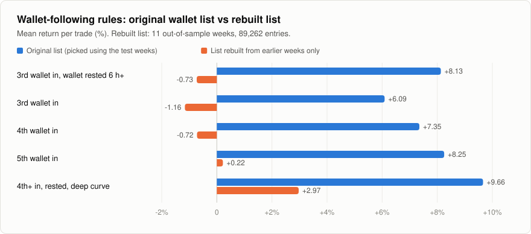

# 1. The wallet list that knew the future

My main strategy showed about +8% a trade in backtests. The wallets it followed had been chosen using the same weeks the backtest ran on. With the list built properly it returns −0.73%.

## What the strategy was

I followed 608 pump.fun wallets that I'd picked for being "durable": active in a lot of weeks, profitable overall, and still trading. On top of that were entry rules, like "buy when the third wallet from the list enters a coin" as a confirmation, because one of the wallet could be buying up every launch.

Backtests on 19 weeks of data showed +6 to +10% a trade for every version of this, and the return went up neatly with arrival order (third wallet better than second, and so on). I had a paper book running and a small real-money bot copying it.

## The problem

The 608 wallets were chosen using weeks 0 to 18. The backtests ran on weeks 0 to 19. So every backtest was scoring wallets that had been picked because of how they did in those exact weeks.

I didn't see it for a while because the two things lived in different scripts. One script built the list, another ran the backtest, and each one was fine on its own.

## The test

Before running anything I wrote down what the test would be ([the file is here](../prereg/rolling-cohort.md); it's one of the early ones where I committed the file and the result together, see [the note on that](../prereg/README.md)).

For each test week, rebuild the wallet list using only the weeks before it. One recipe, decided in advance. Then take that list's first buys in the test week and price them with the same fill model as before. That gave 11 test weeks and 89,262 entries.

To count as surviving, a rule had to clear all of these: at least +2.0% a trade, t of at least 3.0, positive in 8 of the 11 weeks, and at least 500 entries. I also wrote that if nothing passed I wouldn't go back and adjust the recipe to find a version that did.

## Result

<picture>
  <source media="(prefers-color-scheme: dark)" srcset="../docs/img/leaked-vs-honest-dark.svg">
  
</picture>

| Rule | Original list | Rebuilt list | Median | t | Weeks positive |
|---|---|---|---|---|---|
| 3rd wallet in, rested 6h+ (the live one) | +8.13% | −0.73% | −16.88% | −0.78 | 5 of 11 |
| 3rd wallet in | +6.09% | −1.16% | −18.68% | −2.53 | 3 of 11 |
| 4th wallet in | +7.35% | −0.72% | −17.84% | −1.29 | 3 of 11 |
| 5th wallet in | +8.25% | +0.22% | −14.86% | +0.32 | 6 of 11 |
| 4th or later, rested, deep curve | +9.66% | +2.97% | −5.88% | +2.53 | 8 of 11 |
| Every entry, no arrival rule | | −6.96% | −17.42% | −30.29 | 0 of 11 |

Nothing passes. The pattern by arrival order, which was the whole basis of the strategy, is gone: −1.16, −0.72, +0.22 with no trend.

Two things are still worth noting though. The rules do sit 6 to 10 points above the bottom row, so they're doing something. They take a group that loses 7% and get it to about zero.

And the fifth row held up better than the rest. I'm not counting it, because that rule was the best of 1,254 combinations I'd searched on the original (bad) data. Fixing the wallet list doesn't fix the fact that the rule itself was cherry-picked.

## The real-money part

The bot had been running the first row for ten days. 296 buys, 295 sells, 0.348 SOL in and 0.342 SOL out. That's −0.0063 SOL, or −7.9% if you count the rent that was still locked in token accounts. So it cost me about three dollars to watch the same answer come out with real fills. I shut it down.

I had to work out that P&L from the wallet's transactions on chain. The bot's own table had no sale amount recorded for 265 of the 295 sells.
