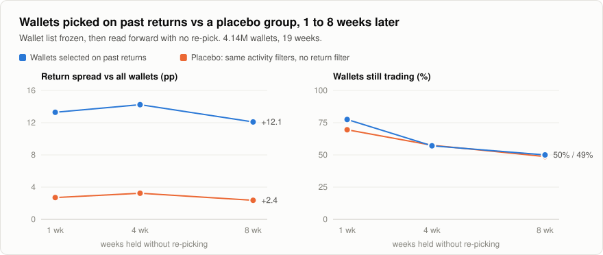

# 2. Why you can't just follow the good wallets

This is the question I spent the most time on. On Solana every trade shows the wallet that made it, and some wallets clearly make money over and over. So why can't you follow them?

What I found is that the good wallets are real and they stay good. But what makes them good is something a follower can't copy. The one time following actually paid me, it was for a completely different reason.

## The good wallets are real

I took all 4.14M pump.fun wallets over 19 weeks. For a given week I picked a group based on past returns, froze the list, and watched it for the next eight weeks without changing it. The number I tracked was the group's average return minus the average for all wallets that same week, so that good and bad market weeks cancel out.

I also built a placebo group with the same activity filters (trades often, been around a while) but no filter on returns. That tells you how much of the effect is just "active wallet".

<picture>
  <source media="(prefers-color-scheme: dark)" srcset="../docs/img/selection-persistence-dark.svg">
  
</picture>

| Weeks later | Selected, spread | Placebo, spread | Selected, still trading | Placebo, still trading |
|---|---|---|---|---|
| 1 | +13.29 pp | +2.71 pp | 77.5% | 69.5% |
| 4 | +14.24 pp | +3.24 pp | 57.1% | 57.5% |
| 8 | +12.09 pp | +2.37 pp | 50.0% | 48.7% |

So about 3 points comes from being an active wallet and about 10 points is real selection. After eight weeks 91% of the gap is still there.

Half the wallets have stopped trading by then. It's tempting to read that as good wallets moving to new addresses so they can't be followed, and I believed that for a long time. But the placebo group disappears at the same rate, so mostly it's just people quitting memecoins.

## What makes them good is their position

A separate pass found 2,101 wallets that win consistently. Between them they take about 14,200 SOL a day, and 63 to 96% of them are still positive the following week.

Then I changed one thing. I kept every trade they made but moved each entry to the worst price in the block they bought in. Every type of winner went negative, between −4% and −16% a trade.

58% of all the winners' profit comes from creators flipping their own launch buy, and that only works when there are bundled wallets buying right behind them. I tried this myself and lost about $9 a launch, which matches what the data says happens without a bundle.

So they win because they created the coin, or they're in the bundle, or they're first in the block. When I simulated buying directly behind them it came out at −11.3% a trade.

## My own filter idea

My idea was to only follow wallets that had real profit of their own, and to drop the ones whose "profit" was really their own buying pushing the price up. I pre-registered it ([file](../prereg/WCLEAN1-clean-wallet-filter.md)) and ran it on 46.66M copy events.

On the first period it looked great: +8.3% a trade against −1.3% without the filter. On the second period it failed. The t-stat was 1.03, three days accounted for more than all of the profit, and only one of the five configurations was positive.

Breaking it down showed something I didn't expect. Copying wallets with positive profit of their own gave −9.2, −8.5, −6.7, +2.1 and −2.7% across the five configurations. Copying everyone gave −2.9, +3.8, +2.8, +2.3 and −0.5%. The profitable wallets were worse to copy.

It makes sense once you see it. A wallet's own profit comes from its entry price, and the copier doesn't get that price. What helps a copier is other buying coming in after them. The wallets I was filtering out, the ones that keep buying their own coin, are exactly the ones that bring that. This is a scam strategy that artificially pumps their token so that it attracts more users, and then they dump on them.

## The one that paid

I ran a bot with real money that bought within a block of a followed wallet's first buy and sold on a small target. By 1 October it had made 655 trades and all of the profit came from one wallet. The other 591 trades averaged 0.0%.

That wallet wasn't a good trader. It was a bot that keeps buying its own coin: one buy, then about eleven more over the next 50 blocks, the price goes up 65 to 94% in twenty seconds, and then it sells. By buying right after its first buy I was getting in ahead of its own later buys.

Then it stopped. On chain I could see it had emptied itself into a new address. Following the funding and the sweeps, it was one operator using five addresses in turn, all funded from the same two wallets and all sending profits to the same place. Its transactions were also recognisable: the same exact fee, the same tip, and a direct call to the program. Over 212 blocks that pattern matched 142 transactions and 141 of them were this operator.

I should say how it ended, because "the one that paid" is only true of those trades. The bot's wallet peaked at 0.62 SOL on 1 October, from 0.381 deposited, and was at 0.13 when I stopped it on 5 October. One day in between lost 0.46 SOL over 239 trades. Over the whole run the trades netted +0.054 SOL across 1,392 round trips. Most of the final loss was 836 tiny test buys I'd sent to measure how fast my orders were landing (−0.230 SOL).

My theory is that he realized he was bleeding from my buys, so he stopped, sent his funds to a CEX, making it very difficult to track his new address. And this is not scaleable as these traders will eventually catch my wallet and either stop or use it to their advantage to sell into my buys, causing me a loss. Another thing regarding why it was difficult to find more traders like him to use to my advantage is that "smarter" traders use different wallets to artificially pump their coins, making it almost impossible to filter it out. Though one thing worth testing is using bubblemaps and series of optimizing the speed and detection of my model to catch more traders like the one I profited from before they stopped...

## Same thing on Polymarket

I had the full Polymarket history (404.5M fills, 1.96M wallets), so I tried the same idea there. Rank wallets on the last 180 days and follow them for the next 28. At their own prices the top wallets make +31 to +35% out of sample, on about 23,000 trades. But the first trade I could have made on the same side, 60 seconds later, costs about 8 cents more, and the copier ends up at −0.9 to −2.4%. Their skill is in the first minute.

## What I took from it

In almost every case, speed wins the race, and some of them I am unable to beat even with the highest quality services that provide latency edge because they bundle wallets. Making it impossible for snipers to buy before the block, and by the time users like me buy, its already too late.
